# Multi-Agent Content Creation System

A sophisticated multi-agent system built with OpenAI's Agents SDK that orchestrates multiple specialized AI agents to research, write, create images, review, and publish content autonomously.

## 🏗️ System Architecture

This system uses a **hierarchical agent delegation pattern** where a top-level orchestrator delegates work to specialized sub-agents, each with their own tools and responsibilities.

### Architecture Diagram

```mermaid
graph TB
    User[👤 User Input] --> CM[🎯 Content Manager Agent]
    
    CM -->|Delegates| RA[🔍 Researcher Agent]
    CM -->|Saves Post| CPT[📄 create_post_file Tool]
    CM -->|Fallback| WFT[💾 write_file Tool]
    
    RA -->|Web Research| WST[🌐 web_search Tool]
    RA -->|Delegates| GW[✍️ Ghostwriter Agent]
    RA -->|Delegates| IC[🎨 Image Creator Agent]
    RA -->|Delegates| QR[✅ Quality Reviewer Agent]
    
    IC -->|Creates Image| IGT[🖼️ generate_image Tool]
    IC -->|Downloads| IDT[⬇️ download_image Tool]
    
    CPT -->|Writes| FS[📁 File System]
    WFT -->|Writes| FS
    IDT -->|Saves| FS
    
    style CM fill:#4A90E2,stroke:#2E5C8A,stroke-width:3px,color:#fff
    style RA fill:#7B68EE,stroke:#483D8B,stroke-width:2px,color:#fff
    style GW fill:#50C878,stroke:#2F7C4F,stroke-width:2px,color:#fff
    style IC fill:#FF6B6B,stroke:#C92A2A,stroke-width:2px,color:#fff
    style QR fill:#FFD93D,stroke:#FAB005,stroke-width:2px,color:#000
```



### Agent Hierarchy & Workflow

```mermaid
sequenceDiagram
    participant User
    participant ContentManager as 🎯 Content Manager
    participant Researcher as 🔍 Researcher
    participant WebSearch as 🌐 Web Search
    participant Ghostwriter as ✍️ Ghostwriter
    participant ImageCreator as 🎨 Image Creator
    participant QualityReviewer as ✅ Quality Reviewer
    participant FileSystem as 📁 File System

    User->>ContentManager: "Create post about AI agents"
    
    ContentManager->>Researcher: research_and_create_post()
    
    Note over Researcher: Coordination Phase
    Researcher->>WebSearch: Search for "AI agents patterns"
    WebSearch-->>Researcher: Research results
    
    Researcher->>Ghostwriter: write_content(research data)
    Ghostwriter-->>Researcher: Draft content
    
    Researcher->>ImageCreator: create_image(description)
    Note over ImageCreator: Image Generation
    ImageCreator->>ImageCreator: generate_image (DALL-E)
    ImageCreator->>ImageCreator: download_image
    ImageCreator-->>Researcher: {url, filePath, prompt}
    
    Researcher->>QualityReviewer: review_quality(content)
    QualityReviewer-->>Researcher: Feedback & suggestions
    
    opt If improvements needed
        Researcher->>Ghostwriter: Revise based on feedback
        Ghostwriter-->>Researcher: Revised content
    end
    
    Researcher-->>ContentManager: {content, imageUrl, imagePath}
    
    ContentManager->>FileSystem: create_post_file()
    FileSystem-->>ContentManager: Success
    
    ContentManager-->>User: ✅ Post created at ./posts/...
```



## 🤖 Agent Roles & Responsibilities

### 1. 🎯 Content Manager Agent
**Role**: Top-level orchestrator  
**Model**: GPT-4o  
**Responsibilities**:
- Receives user requests
- Delegates to Researcher Agent
- Saves final output to filesystem
- Ensures proper file structure

**Tools**:
- `research_and_create_post` - Delegates to Researcher
- `create_post_file` - Saves post with image references
- `write_file` - Fallback for plain text

### 2. 🔍 Researcher Agent
**Role**: Coordination & research  
**Model**: GPT-4o  
**Responsibilities**:
- Web research on topics
- Coordinates all specialized agents
- Ensures quality through iteration
- Compiles final deliverable

**Tools**:
- `web_search` - Internet research
- `write_content` - Delegates to Ghostwriter
- `create_image` - Delegates to Image Creator
- `review_quality` - Delegates to Quality Reviewer

### 3. ✍️ Ghostwriter Agent
**Role**: Content creation specialist  
**Model**: GPT-4o  
**Settings**: Temperature: 1 (creative)  
**Responsibilities**:
- Writes engaging, professional content
- Follows platform-specific formatting
- Incorporates research findings

### 4. 🎨 Image Creator Agent
**Role**: Visual content generation  
**Model**: GPT-4o  
**Responsibilities**:
- Creates DALL-E image prompts
- Generates images via DALL-E 3
- Downloads images locally
- Returns URLs and file paths

**Tools**:
- `generate_image` - DALL-E 3 integration
- `download_image` - Local file storage

### 5. ✅ Quality Reviewer Agent
**Role**: Content quality assurance  
**Model**: GPT-4o  
**Settings**: Temperature: 1  
**Responsibilities**:
- Grammar and spelling checks
- Clarity and readability review
- Engagement and tone assessment
- Professional formatting verification

## 🛠️ System Tools

### File Operations
- **`write_file`**: Basic file writing
- **`create_post_file`**: Specialized post creation with image metadata

### Image Operations
- **`generate_image`**: DALL-E 3 image generation
- **`download_image`**: Downloads images from URLs to local filesystem

### Research
- **`web_search`**: Real-time web search capability

## 📂 Project Structure

```
open-ai-agent/
├── index.ts                    # Entry point
├── package.json                # Dependencies & scripts
├── tsconfig.json              # TypeScript config
├── jest.config.js             # Test configuration
├── .env                       # Environment variables
├── agents/
│   ├── index.ts               # Agent exports
│   ├── contentManagerAgent.ts # 🎯 Top-level orchestrator
│   ├── researcherAgent.ts     # 🔍 Coordinator
│   ├── ghostwriterAgent.ts    # ✍️ Content writer
│   ├── imageCreatorAgent.ts   # 🎨 Image generation
│   └── qualityReviewerAgent.ts # ✅ Quality assurance
├── tools/
│   └── index.ts               # All tool implementations
├── utils/
│   └── logger.ts              # Logging utilities
└── __tests__/                 # Unit tests
    ├── agents/
    ├── tools/
    └── utils/
```

## 🚀 Getting Started

### Prerequisites

- Node.js 18+
- TypeScript
- OpenAI API key

### Installation

```bash
# Install dependencies
npm install

# Set up environment variables
cp .env.example .env
# Edit .env and add your OPENAI_API_KEY
```

### Configuration

Create a `.env` file:
```env
OPENAI_API_KEY=sk-...
```

### Running

```bash
# Run the agent system
npm start

# Run tests
npm test

# Run tests with coverage
npm run test:coverage

# Watch mode for development
npm run test:watch
```

## 📊 Data Flow

```mermaid
flowchart LR
    A[User Prompt] --> B[Content Manager]
    B --> C[Researcher Agent]
    C --> D[Web Search]
    C --> E[Ghostwriter]
    C --> F[Image Creator]
    C --> G[Quality Reviewer]
    
    F --> H[DALL-E API]
    H --> I[Image URL]
    I --> J[Local Download]
    
    E --> K[Draft Content]
    G --> L[Reviewed Content]
    
    D --> M[Research Data]
    K --> N[Final Content]
    L --> N
    M --> N
    J --> N
    
    N --> O[create_post_file]
    O --> P[📄 posts/output.md]
    J --> Q[🖼️ images/image.png]
    
    style A fill:#E3F2FD
    style P fill:#C8E6C9
    style Q fill:#FFE0B2
```



## 🎯 Use Cases

1. **LinkedIn Posts**: Research-backed professional content with visuals
2. **Blog Articles**: Long-form content with relevant imagery
3. **Social Media**: Engaging posts with custom graphics
4. **Marketing Content**: Brand-aligned content with visuals
5. **Educational Content**: Informative posts with explanatory images

## 🔧 Advanced Features

### Logging & Observability
- Comprehensive logging for each agent and tool
- Execution time tracking
- Nested agent call visualization

### Error Handling
- Graceful fallbacks for failed operations
- Retry logic for API calls
- Detailed error messages

### Quality Assurance
- Multi-pass review system
- Iterative improvement loop
- Grammar and style checking

## 🧪 Testing

The system includes comprehensive unit tests:

- **19 passing tests** across 5 test suites
- Mocked external dependencies (OpenAI API, filesystem, network)
- Coverage for all tools and agent configurations

```bash
# Run all tests
npm test

# Coverage report
npm run test:coverage
```

See [__tests__/README.md](__tests__/README.md) for detailed testing documentation.

## 🏛️ Architecture Patterns

### 1. Hierarchical Agent Delegation
- Top-down control flow
- Clear responsibility separation
- Specialized agent roles

### 2. Tool Wrapping Pattern
- Logging wrappers for observability
- Consistent interface across tools
- Error handling at tool level

### 3. Coordinator Pattern
- Researcher agent as central coordinator
- Multiple specialist agents
- Iterative improvement workflow

### 4. Compositional Tool Design
- Small, focused tools
- Composable functionality
- Reusable across agents

## 🔐 Security Considerations

- API keys stored in environment variables
- No hardcoded credentials
- File system operations sandboxed to project directory
- Input validation on all tools

## 🚦 Performance

- **Concurrent Operations**: Agents can work in parallel where possible
- **Streaming Support**: Real-time output streaming
- **Caching**: Web search results can be cached (future enhancement)
- **Async by Default**: All operations are non-blocking

## 📈 Future Enhancements

- [ ] Memory/conversation persistence across runs
- [ ] Vector database for semantic search
- [ ] Custom image style presets
- [ ] Multi-language support
- [ ] API endpoint exposure
- [ ] Web UI for monitoring
- [ ] Agent performance metrics
- [ ] Cost tracking per workflow

## 🤝 Contributing

1. Fork the repository
2. Create a feature branch
3. Add tests for new functionality
4. Ensure all tests pass
5. Submit a pull request

## 📄 License

ISC

## 🙏 Acknowledgments

Built with:
- [OpenAI Agents SDK](https://github.com/openai/agents) - Agent framework
- [OpenAI API](https://openai.com/api/) - GPT-4o and DALL-E 3
- [TypeScript](https://www.typescriptlang.org/) - Type safety
- [Jest](https://jestjs.io/) - Testing framework
- [Zod](https://zod.dev/) - Schema validation

---

**Note**: This is a demonstration project showcasing multi-agent orchestration patterns with the OpenAI Agents SDK. Adapt and extend based on your specific use case.
